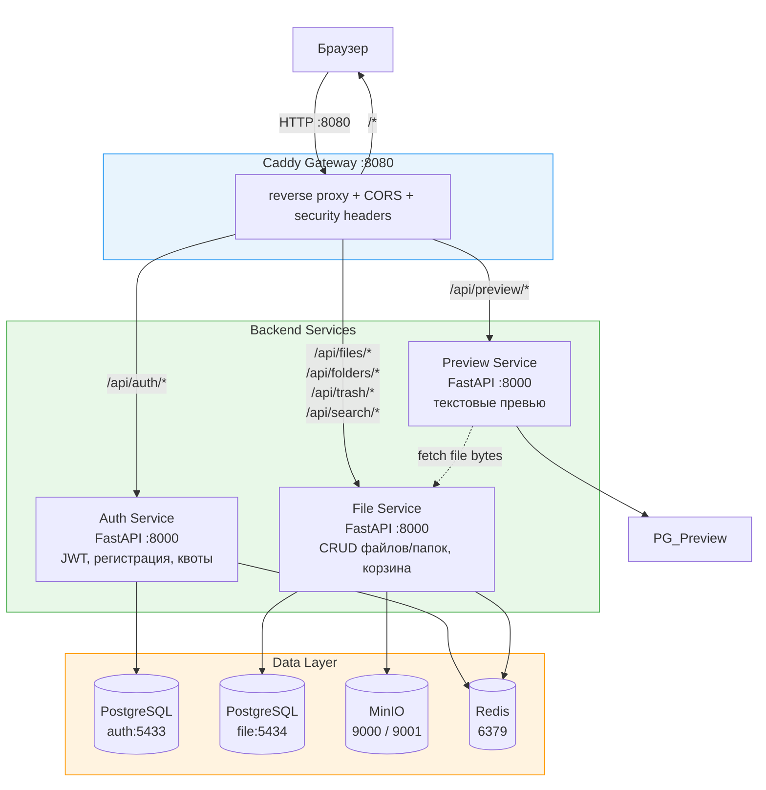
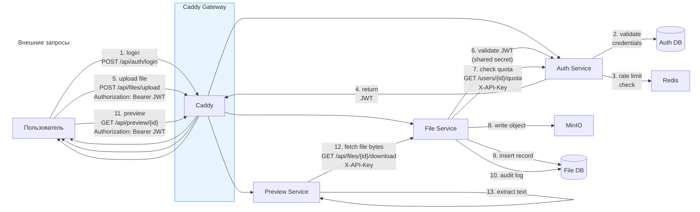
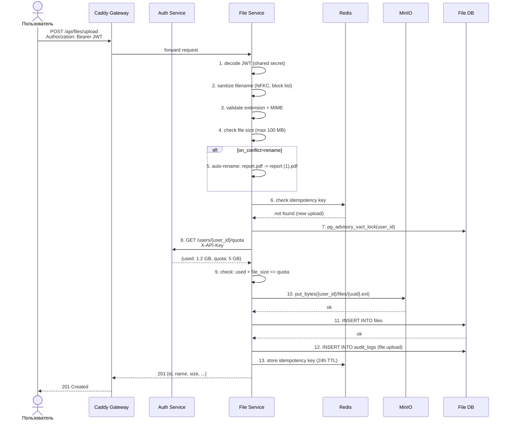
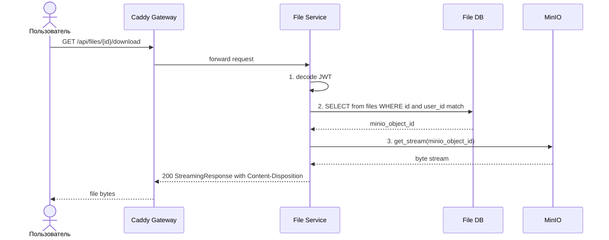
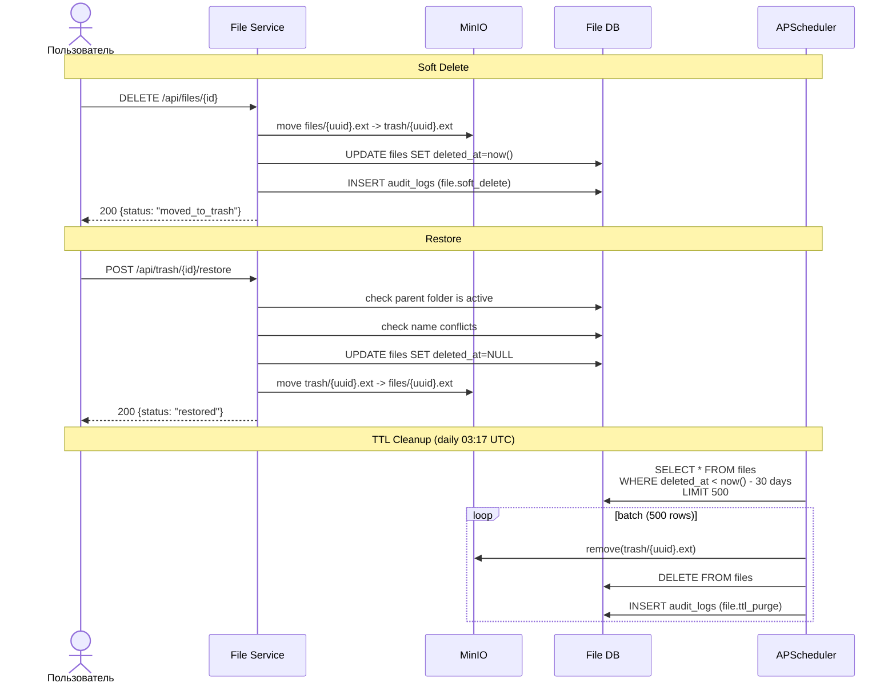
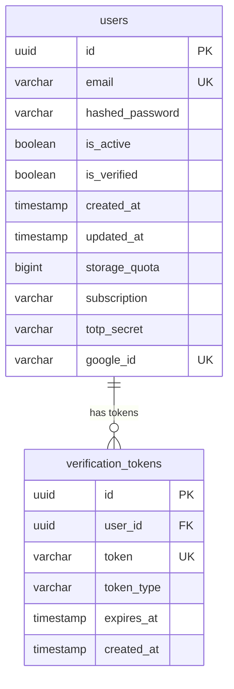
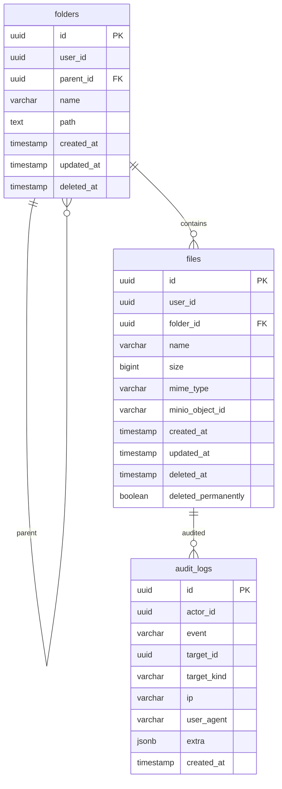
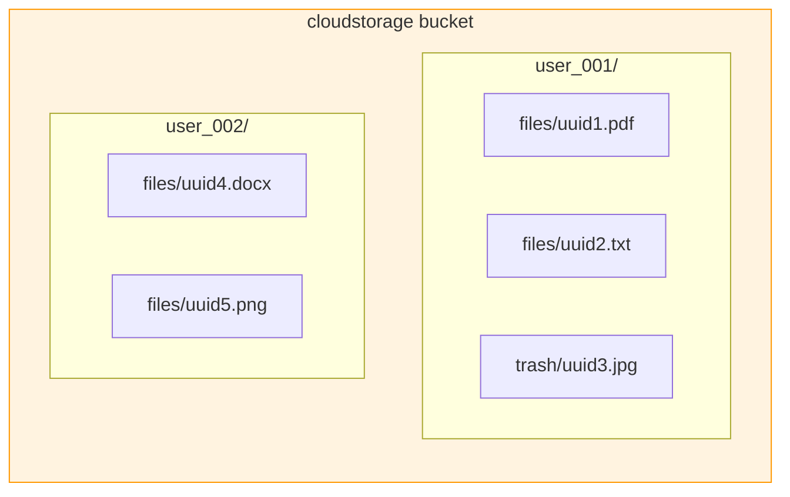
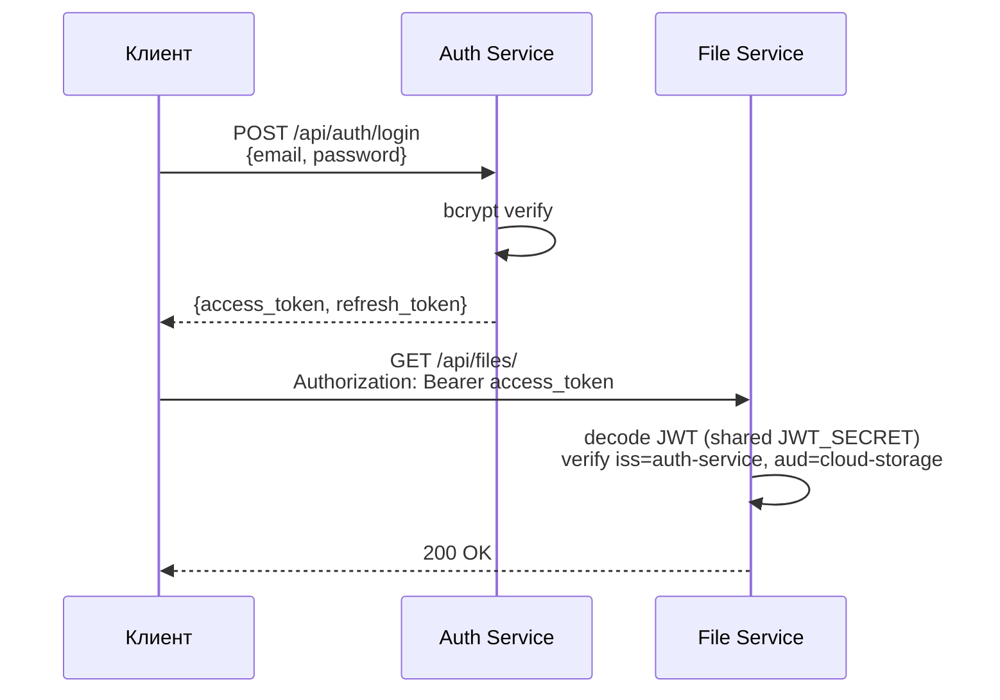

# Архитектура Cloud File Storage

## Обзор

| Параметр | Значение |
|----------|----------|
| Архитектура | Микросервисы с раздельными БД |
| Backend | Python + FastAPI |
| Frontend | React + shadcn/ui + Tailwind CSS |
| API Gateway | Caddy |
| Хранилище | MinIO (S3-совместимое) |
| Базы данных | PostgreSQL (отдельная на сервис) |
| Кэш | Redis 7 |
| Контейнеризация | Docker + Docker Compose |
| Межсервисная коммуникация | REST + API keys |

## Высокоуровневая архитектура

## Межсервисная коммуникация

## Поток загрузки файла

## Поток скачивания файла

## Поток корзины (soft delete + TTL cleanup)

## Схема базы данных

### Auth Service

### File Service

## MinIO: структура бакета

| Префикс | Назначение | Операции |
|---------|-----------|----------|
| `{user_id}/files/` | Активные файлы | put, get, move, remove |
| `{user_id}/trash/` | Удалённые файлы (30 дней) | get, remove |

## Технологический стек

### Backend

| Компонент | Технология |
|-----------|------------|
| Фреймворк | FastAPI (async) |
| ORM | SQLAlchemy 2.0 + asyncpg |
| Миграции | Alembic |
| Валидация | Pydantic v2 |
| JWT | python-jose (HS256) |
| Email | aiosmtplib + Jinja2 |
| Логирование | structlog |
| MinIO SDK | minio |
| Тесты | pytest + httpx + testcontainers |

### Frontend

| Компонент | Технология |
|-----------|------------|
| Фреймворк | React 18 + Vite |
| UI | shadcn/ui (Radix UI + Tailwind CSS) |
| State | Zustand |
| Роутинг | React Router v6 |
| HTTP | Axios |

### Инфраструктура

| Компонент | Технология |
|-----------|------------|
| Gateway | Caddy 2 |
| БД | PostgreSQL 15 |
| Хранилище | MinIO |
| Кэш | Redis 7 |
| Контейнеры | Docker + Docker Compose |

## Безопасность

### Аутентификация

| Механизм | Реализация |
|----------|-----------|
| User auth | JWT access + refresh токены (HS256) |
| Service-to-service | `X-API-Key` header (общий `SERVICE_API_KEY`) |
| Passwords | bcrypt (passlib) |
| Rate limiting | Redis fixed-window (fail-open) |
| CORS | конкретный origin, не `*` |
| Security headers | X-Content-Type-Options, X-Frame-Options, CSP, Referrer-Policy |

### Rate Limiting

| Endpoint | Лимит |
|----------|-------|
| Login | 10 req/min на IP |
| Register | 5 req/min на IP |
| Password reset | 3 req/min на IP |
| File upload | 20 req/min на пользователя |
| File delete | 60 req/min на пользователя |
| По умолчанию | 300 req/min на пользователя |

При ошибках Redis — fail-open (запрос проходит).

### Квоты

| Тариф | Квота |
|-------|-------|
| free | 5 ГБ |
| pro | 100 ГБ |
| team | 500 ГБ |

Проверка квоты через `pg_advisory_xact_lock` для атомарности при параллельных загрузках.

## Переменные окружения

| Переменная | Сервис | Обязательна | Описание |
|------------|--------|-------------|----------|
| `JWT_SECRET` | Auth, File | Да | HMAC-секрет для JWT |
| `SERVICE_API_KEY` | Все | Да | Ключ межсервисной коммуникации |
| `REDIS_PASSWORD` | Auth, File | Да | Пароль Redis |
| `POSTGRES_PASSWORD` | Все | Да | Пароль PostgreSQL |
| `MINIO_ROOT_USER` | File | Да | Пользователь MinIO |
| `MINIO_ROOT_PASSWORD` | File | Да | Пароль MinIO |
| `DATABASE_URL` | Каждый | Да | URL подключения к БД сервиса |
| `REDIS_URL` | Auth, File | Нет | URL Redis (fail-open если не задан) |
| `SMTP_HOST` | Auth | Нет | SMTP сервер для email |
| `MINIO_BUCKET` | File | Нет | Имя бакета (по умолчанию `cloudstorage`) |
