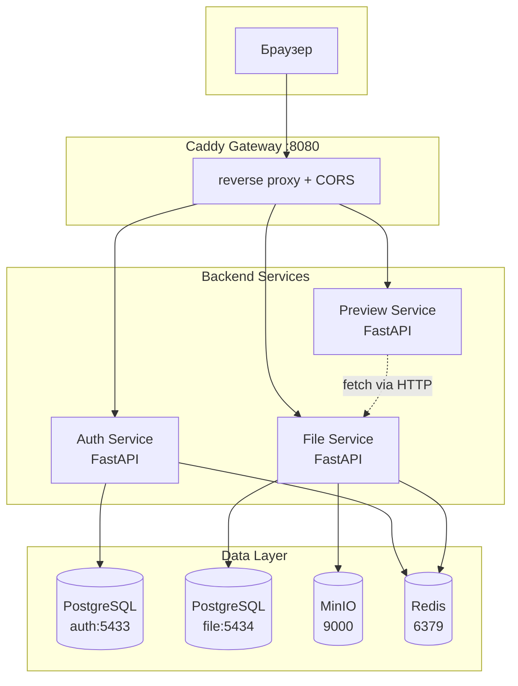

# Пояснительная записка к курсовому проекту

## Cloud File Storage — облачное хранилище файлов на микросервисной архитектуре

---

## 1. Актуальность и постановка проблемы

### 1.1. Актуальность

Облачные хранилища файлов (Dropbox, Google Drive, Яндекс.Диск) являются одним из наиболее востребованных классов веб-приложений. По данным Statista, в 2025 году количество пользователей облачных хранилищ в мире превысило 2 млрд человек. Такие системы представляют собой сложные распределённые приложения, требующие решения целого ряда инженерных задач:

- надёжное хранение больших объёмов данных;
- безопасная аутентификация и авторизация;
- работа с иерархической структурой данных (папки);
- обеспечение отказоустойчивости и масштабируемости;
- контроль квот хранения;
- предотвращение потери данных (корзина с возможностью восстановления).

### 1.2. Цель проекта

Разработка функционального прототипа облачного хранилища файлов с микросервисной архитектурой, реализующего:

- регистрацию и аутентификацию пользователей;
- загрузку, скачивание и удаление файлов;
- управление иерархией папок;
- корзину с механизмом восстановления и автоматической очистки;
- контроль квот хранения;
- предпросмотр файлов различных форматов;
- поиск по имени файлов.

### 1.3. Задачи

1. Спроектировать микросервисную архитектуру системы.
2. Разработать Auth Service — сервис аутентификации и управления пользователями.
3. Разработать File Service — сервис управления файлами и папками.
4. Разработать Preview Service — сервис генерации превью файлов.
5. Реализовать фронтенд-приложение с интуитивным интерфейсом.
6. Настроить API Gateway и маршрутизацию.
7. Обеспечить безопасность межсервисного взаимодействия.
8. Протестировать работоспособность системы.

---

## 2. Обзор существующих решений

### 2.1. Анализ коммерческих решений

| Сервис | Архитектура | Особенности |
|--------|-------------|-------------|
| Dropbox | Микросервисы (Python, Go) | Блокочная дедупликация, delta-синхронизация |
| Google Drive | Микросервисы (Java, C++) | Интеграция с Google Workspace, OCR |
| Яндекс.Диск | Микросервисы | Интеграция с экосистемой Яндекса |

### 2.2. Анализ OpenSource решений

| Проект | Стек | Архитектура |
|--------|------|-------------|
| Nextcloud | PHP + PostgreSQL | Монолит с плагинами |
| ownCloud | PHP + PostgreSQL | Монолит |
| Seafile | Python/C + MySQL | Клиент-сервер с блочной синхронизацией |

### 2.3. Вывод

Существующие OpenSource решения используют монолитную архитектуру, что ограничивает масштабируемость отдельных компонентов. Коммерческие решения закрыты и не предоставляют возможности изучения архитектуры. Данный проект позволяет исследовать микросервисный подход к проектированию облачного хранилища.

---

## 3. Архитектура системы

### 3.1. Общая архитектура

Система построена по микросервисной архитектуре и состоит из 5 основных компонентов:



### 3.2. Принципы проектирования

**Разделение ответственности (Single Responsibility).** Каждый сервис отвечает за одну предметную область: Auth — аутентификация, File — файлы, Preview — превью.

**Изоляция данных.** Каждый сервис имеет собственную базу данных. Это обеспечивает независимость схем и возможность отдельного масштабирования.

**Межсервисная коммуникация через REST.** Сервисы общаются по HTTP с аутентификацией через `X-API-Key` заголовок. Внутри Docker-сети запросы идут по имени сервиса (например, `http://file:8000`).

**API Gateway.** Caddy обеспечивает единую точку входа, маршрутизацию, CORS, security headers и шифрование.

### 3.3. Обоснование выбора архитектуры

Микросервисная архитектура выбрана по следующим причинам:

1. **Независимое масштабирование.** File Service нагружается при загрузке/скачивании, Auth Service — при входах. Их можно масштабировать по отдельности.

2. **Технологическая независимость.** Preview Service не использует БД — он stateless и может быть заменён без влияния на другие сервисы.

3. **Изоляция отказов.** Если Preview Service недоступен, загрузка и скачивание файлов продолжают работать.

4. **Параллельная разработка.** Три разработчика могут работать над сервисами одновременно без конфликтов.

---

## 4. Технологический стек

### 4.1. Backend

| Компонент | Технология | Обоснование выбора |
|-----------|------------|---------------------|
| Фреймворк | FastAPI | Асинхронность (async/await), автогенерация OpenAPI, валидация через Pydantic, высокая производительность |
| ORM | SQLAlchemy 2.0 | Зрелая ORM с поддержкой async через asyncpg, декларативное определение моделей |
| БД | PostgreSQL 15 | ACID-транзакции, поддержка advisory locks, JSONB, индексы |
| Миграции | Alembic | Автоматическая генерация миграций, поддержка Alembic для SQLAlchemy |
| Валидация | Pydantic v2 | Валидация на уровне моделей, автогенерация JSON Schema, интеграция с FastAPI |
| JWT | python-jose | Поддержка HS256, проверка claims (iss, aud) |
| Логирование | structlog | Структурированное логирование, JSON в production, человекочитаемое в dev |
| Тестирование | pytest + testcontainers | Эфемерные контейнеры PostgreSQL для интеграционных тестов |

**Почему FastAPI, а не Django/Flask:**

- Django: синхронный по умолчанию, тяжеловесен для микросервиса, ORM привязана к фреймворку.
- Flask: минималистичен, но нет автогенерации API-документации, нет встроенной валидации.
- FastAPI: асинхронность из коробки, автогенерация Swagger/ReDoc, валидация через Pydantic, производительность на уровне Go/Node.js.

### 4.2. Frontend

| Компонент | Технология | Обоснование |
|-----------|------------|-------------|
| Фреймворк | React 18 | Компонентный подход, виртуальный DOM, богатая экосистема |
| Сборщик | Vite | Мгновенный HMR, быстрая сборка, ESBuild |
| UI | shadcn/ui | Переиспользуемые компоненты на Radix UI + Tailwind CSS, доступность (a11y) |
| State | Zustand | Минималистичный state manager (~1 KB), простое API |
| Роутинг | React Router v6 | Декларативный роутинг, вложенные маршруты |
| HTTP | Axios | Интерceptor для авто-обновления JWT, обработка ошибок |

### 4.3. Инфраструктура

| Компонент | Технология | Обоснование |
|-----------|------------|-------------|
| Gateway | Caddy 2 | Автоматический HTTPS, конфигурация через Caddyfile, security headers |
| Хранилище | MinIO | S3-совместимое, open source, локальное развертывание |
| Кэш | Redis 7 | Rate limiting, кэширование квот, идемпотентность |
| Контейнеры | Docker | Изоляция, воспроизводимость, единый формат для всех сервисов |
| Оркестрация | Docker Compose | Определение всех сервисов в одном файле, health checks, depends_on |

---

## 5. Описание сервисов

### 5.1. Auth Service

**Назначение:** Аутентификация, авторизация, управление пользователями и квотами.

**Функциональность:**

- Регистрация пользователя (email + пароль).
- Вход в систему с выдачей JWT access + refresh токенов.
- Обновление access токена через refresh токен.
- Выход из системы (отзыв refresh токена).
- Верификация email по токену.
- Восстановление пароля через email.
- Переключение тарифа (free/pro/team).
- Предоставление квоты хранилища для File Service (межсервисный вызов).

**Схема аутентификации:**

```
Пользователь -> POST /api/auth/login -> Auth Service
    1. Проверка email + bcrypt хеш пароля
    2. Генерация access токена (30 мин) + refresh токена (7 дней)
    3. Возврат токенов клиенту

Клиент -> GET /api/files/ -> File Service (Authorization: Bearer access_token)
    1. File Service декодит JWT (общий JWT_SECRET)
    2. Проверяет claims: iss=auth-service, aud=cloud-storage
    3. Извлекает user_id из sub
```

**Структура JWT:**

```json
{
  "sub": "uuid-пользователя",
  "email": "user@example.com",
  "type": "access",
  "iss": "auth-service",
  "aud": "cloud-storage",
  "exp": 1234567890
}
```

**База данных (users, verification_tokens):**

| Таблица | Назначение |
|---------|-----------|
| users | Учётные записи пользователей (email, хеш пароля, квота, тариф) |
| verification_tokens | Токены верификации email и сброса пароля |

**Rate Limiting:**

| Endpoint | Лимит | Причина |
|----------|-------|---------|
| Login | 10 req/min | Защита от brute force |
| Register | 5 req/min | Предотвращение спама |
| Password reset | 3 req/min | Защита от перебора |

### 5.2. File Service

**Назначение:** Полный жизненный цикл файлов — загрузка, скачивание, организация, поиск, удаление, восстановление.

**Функциональность:**

- Загрузка файлов (multipart, до 100 МБ).
- Скачивание файлов (потоковое, StreamingResponse).
- Управление папками (создание, переименование, перемещение).
- Корзина (мягкое удаление, восстановление, окончательное удаление).
- Каскадное удаление/восстановление папок (BFS-обход).
- Поиск по имени (ILIKE).
- Bulk-операции (до 200 файлов за вызов).
- Контроль квоты хранилища.
- Аудит-логирование всех действий.

**Алгоритм загрузки файла:**

1. Санитизация имени (нормализация NFKC, удаление path traversal).
2. Валидация расширения по блок-листу (.exe, .bat, .ps1, .dll — отклоняются).
3. Валидация MIME-типа.
4. Проверка размера (max 100 МБ).
5. Проверка владения целевой папкой.
6. Разрешение конфликтов имени (reject или auto-rename с суффиксом `(N)`).
7. Блокировка `pg_advisory_xact_lock(user_id)` для атомарной проверки квоты.
8. Проверка квоты: `used_size + file_size <= quota`.
9. Запись в MinIO (`{user_id}/files/{uuid}.{ext}`).
10. Вставка записи в PostgreSQL.
11. Запись аудит-события (`file.upload`).

**Механизм корзины:**

```
Удаление:
  1. Объект MinIO: files/{uuid}.ext -> trash/{uuid}.ext
  2. DB: UPDATE files SET deleted_at = now()

Восстановление:
  1. Сбор поддерева удалённых элементов
  2. Проверка активности родительской папки
  3. Проверка конфликтов имён
  4. DB: UPDATE files SET deleted_at = NULL
  5. Объект MinIO: trash/{uuid}.ext -> files/{uuid}.ext

Автоочистка (APScheduler, ежедневно 03:17 UTC):
  SELECT * FROM files WHERE deleted_at < now() - INTERVAL '30 days'
  Для каждого: удалить из MinIO + DELETE FROM files
```

**Контроль квоты:**

```
1. File Service получает запрос на загрузку
2. pg_advisory_xact_lock(user_id) — блокировка на уровне БД
3. SELECT SUM(size) FROM files WHERE user_id = ? AND deleted_at IS NULL
4. GET /api/users/{user_id}/quota (кэш 60 сек) -> {quota: 5368709120}
5. Если used + file_size > quota -> QuotaExceeded (413)
6. Иначе -> продолжить загрузку
```

Использование `pg_advisory_xact_lock` гарантирует атомарность: два параллельных запроса на загрузку не превысят квоту.

**Модели данных (files, folders, audit_logs):**

| Таблица | Назначение |
|---------|-----------|
| files | Метаданные файлов (имя, размер, MIME, MinIO ключ, soft-delete) |
| folders | Иерархия папок (parent_id, self-referencing FK) |
| audit_logs | Журнал действий (actor, event, target, IP, user_agent) |

### 5.3. Preview Service

**Назначение:** Генерация текстовых превью для форматов, которые браузеры не отображают нативно.

**Особенности:**

- Stateless — не имеет собственной БД.
- Работает как прокси: запрашивает файл у File Service, извлекает текст.
- Поддержка: TXT, CSV, JSON, DOCX, XLSX.
- Для image/PDF используется browser-native preview (без этого сервиса).

**Поддерживаемые форматы:**

| Формат | Библиотека | Описание |
|--------|-----------|----------|
| TXT | stdlib decode | Полное содержимое |
| CSV | stdlib decode | Полное содержимое |
| JSON | json.dumps(indent=2) | Форматированный вывод |
| DOCX | python-docx | Извлечение абзацев и таблиц |
| XLSX | openpyxl | Первый лист, до 100 строк, табуляция |

**Безопасность:**

- Валидация file_id (UUID-формат, защита от SSRF).
- Лимит размера файла (10 МБ).
- XXE-защита: DOCX валидируется как ZIP-архив перед парсингом.
- Санитизация ошибок: 5xx ответы upstream не раскрывают детали.

### 5.4. Frontend

**Назначение:** Веб-интерфейс для работы с хранилищем.

**Страницы:**

| Страница | Назначение |
|----------|-----------|
| Login | Вход в систему |
| Register | Регистрация |
| Files | Файловый менеджер (grid/list, drag-and-drop, контекстное меню) |
| Trash | Корзина (восстановление, окончательное удаление) |
| Security | Настройки безопасности (заготовка для 2FA) |
| Billing | Информация о тарифе и квоте |

**Ключевые компоненты:**

- **FileBrowser** — отображение файлов и папок в режимах grid/list с drag-and-drop.
- **UploadDropzone** — зона drag-and-drop загрузки с прогресс-баром.
- **UploadProgress** — очередь загрузки (макс. 5 параллельных, отмена, retry).
- **PreviewModal** — предпросмотр файлов (image/PDF через browser, text/csv/json/docx/xlsx через preview-service).
- **QuotaCard** — отображение использования хранилища.
- **ItemActionsMenu** — контекстное меню (переименование, перемещение, удаление, скачивание).

**State Management (Zustand):**

```javascript
// Auth store: register, login, logout, refreshProfile, switchPlan
// File store: loadFolder, uploadFiles, searchItems, moveToTrash, restoreItem
// Persist: localStorage для offline-восстановления сессии
```

**Обработка JWT:**

```javascript
// Axios interceptor:
// 1. Автоматическое добавление Authorization: Bearer {token} к каждому запросу
// 2. При 401: попытка refresh токена
// 3. При неудачном refresh: redirect на /login
```

### 5.5. Caddy Gateway

**Назначение:** Единая точка входа, маршрутизация, безопасность.

**Маршрутизация:**

| Путь | Backend |
|------|---------|
| `/api/auth/*` | Auth Service |
| `/api/files/*`, `/api/folders/*`, `/api/trash/*`, `/api/search/*` | File Service |
| `/api/preview/*` | Preview Service |
| `/health`, `/health/*` | Соответствующий сервис |
| `/docs/*`, `/redoc/*`, `/openapi/*` | Swagger UI |
| `/*` | Frontend (SPA) |

**Security Headers:**

```
X-Content-Type-Options: nosniff
X-Frame-Options: DENY
Referrer-Policy: no-referrer
Permissions-Policy: geolocation=(), microphone=(), camera=()
Content-Security-Policy: default-src 'none'; frame-ancestors 'none'
Cache-Control: no-store (для API)
```

**CORS:**

```
Access-Control-Allow-Origin: http://localhost:8080
Access-Control-Allow-Credentials: true
Access-Control-Allow-Headers: Content-Type, Authorization, X-API-Key
```

---

## 6. Проектирование базы данных

### 6.1. Auth Service

```sql
CREATE TABLE users (
    id              UUID PRIMARY KEY DEFAULT gen_random_uuid(),
    email           VARCHAR(255) UNIQUE NOT NULL,
    hashed_password VARCHAR(255) NOT NULL,
    is_active       BOOLEAN DEFAULT TRUE,
    is_verified     BOOLEAN DEFAULT FALSE,
    created_at      TIMESTAMP DEFAULT NOW(),
    storage_quota   BIGINT DEFAULT 5368709120,  -- 5 GB
    subscription    VARCHAR(50) DEFAULT 'free'
);

CREATE TABLE verification_tokens (
    id         UUID PRIMARY KEY DEFAULT gen_random_uuid(),
    user_id    UUID REFERENCES users(id) ON DELETE CASCADE,
    token      VARCHAR(255) UNIQUE NOT NULL,
    token_type VARCHAR(50),  -- 'email_verify' | 'password_reset'
    expires_at TIMESTAMP NOT NULL
);
```

**Индексы:** `idx_users_email`, `idx_verification_tokens_token`, `idx_verification_tokens_expires_at`.

### 6.2. File Service

```sql
CREATE TABLE folders (
    id         UUID PRIMARY KEY DEFAULT gen_random_uuid(),
    user_id    UUID NOT NULL,
    parent_id  UUID REFERENCES folders(id) ON DELETE CASCADE,
    name       VARCHAR(255) NOT NULL,
    path       TEXT,
    deleted_at TIMESTAMP
);

CREATE TABLE files (
    id                  UUID PRIMARY KEY DEFAULT gen_random_uuid(),
    user_id             UUID NOT NULL,
    folder_id           UUID REFERENCES folders(id) ON DELETE SET NULL,
    name                VARCHAR(255) NOT NULL,
    size                BIGINT NOT NULL,
    mime_type           VARCHAR(100),
    minio_object_id     VARCHAR(255) NOT NULL,
    deleted_at          TIMESTAMP,
    deleted_permanently BOOLEAN DEFAULT FALSE
);

CREATE TABLE audit_logs (
    id           UUID PRIMARY KEY DEFAULT gen_random_uuid(),
    actor_id     UUID,
    event        VARCHAR(50),
    target_id    UUID,
    target_kind  VARCHAR(32),
    ip           VARCHAR(64),
    user_agent   TEXT,
    extra        JSONB,
    created_at   TIMESTAMP DEFAULT NOW()
);
```

**Индексы:** `idx_files_user_id`, `idx_files_folder_id`, `idx_files_deleted_at`, `idx_folders_user_parent`, `idx_audit_logs_user_id`.

### 6.3. Обоснование решений

- **UUID вместо SERIAL:** распределённая система, нет необходимости в последовательной нумерации, безопасность (нельзя угадать ID).
- **Soft delete через `deleted_at`:** возможность восстановления, аудит, сохранение ссылочной целостности.
- **ON DELETE SET NULL для folder_id:** при удалении папки файлы не удаляются, а перемещаются в корень.
- **JSONB для extra в audit_logs:** гибкое хранение контекстной информации без изменения схемы.

---

## 7. Безопасность

### 7.1. Аутентификация

- **JWT access токены** (30 мин) для доступа к API.
- **Refresh токены** (7 дней) для получения новых access токенов.
- **Хранение паролей:** bcrypt (salt + хеширование).
- **Проверка claims:** `iss=auth-service`, `aud=cloud-storage` — все сервисы проверяют токен.

### 7.2. Авторизация

- Каждый пользователь видит только свои файлы (`WHERE user_id = ?`).
- Межсервисные вызовы аутентифицируются через `X-API-Key`.
- Внутренние эндпоинты (quota, cache invalidation) доступны только с валидным API ключом.

### 7.3. Защита от атак

| Атака | Мера защиты |
|-------|------------|
| Brute force | Rate limiting (Redis fixed-window): login 10/мин, register 5/мин |
| Path traversal | Санитизация имён файлов, удаление `../`, проверка на Windows-зарезервированные имена |
| Загрузка вирусов | Блок-лист расширений (50+ паттернов: .exe, .bat, .ps1, .dll) |
| SSRF | Валидация file_id как UUID, запрет path traversal |
| XSS | Security headers (CSP, X-Content-Type-Options) |
| Clickjacking | X-Frame-Options: DENY |
| MITM | CORS с конкретным origin, не `*` |
| XXE | DOCX валидируется как ZIP перед парсингом |

### 7.4. Идемпотентность

Redis-backed `Idempotency-Key` для POST /api/files/upload. При повторном запросе с тем же ключом возвращается кешированный ответ (24 часа). Это защищает от повторной загрузки при обрыве сети.

---

## 8. Деплой и развёртывание

### 8.1. Docker Compose

Все сервисы определены в одном `docker-compose.yml`:

```yaml
services:
  gateway:     # Caddy, порт 8080
  auth:        # FastAPI, порт 8000 (внутренний)
  file:        # FastAPI, порт 8000 (внутренний)
  preview:     # FastAPI, порт 8000 (внутренний)
  frontend:    # Nginx + React, порт 80 (внутренний)
  postgres-auth:   # PostgreSQL, порт 5433
  postgres-file:   # PostgreSQL, порт 5434
  minio:       # MinIO, порт 9000/9001
  redis:       # Redis, порт 6379
```

### 8.2. Health Checks

Каждый сервис имеет health check:

```yaml
healthcheck:
  test: ["CMD", "python", "-c", "import httpx; httpx.get('http://localhost:8000/health')"]
  interval: 10s
  timeout: 5s
  retries: 5
```

Сервисы с health checks запускаются в правильном порядке через `depends_on: condition: service_healthy`.

### 8.3. Безопасность контейнеров

```yaml
security_opt:
  - no-new-privileges:true
cap_drop:
  - ALL
```

Контейнеры работают без привилегий, с минимальным набором возможностей.

---

## 9. Тестирование

### 9.1. Уровни тестирования

| Уровень | Инструмент | Покрытие |
|---------|-----------|----------|
| Unit-тесты | pytest | Бизнес-логика, валидация, утилиты |
| Интеграционные | pytest + testcontainers | Взаимодействие с PostgreSQL, MinIO |
| Smoke-тесты | gateway_smoke.py | Полный цикл через gateway |

### 9.2. Smoke-тест

Скрипт `scripts/gateway_smoke.py` проверяет полный цикл:

1. Health check всех сервисов.
2. Регистрация → логин → /me.
3. Верификация email.
4. Создание папки → загрузка файла → поиск → скачивание.
5. Корзина: удаление → восстановление → окончательное удаление.
6. Forgot password → reset password → login новым паролом.
7. Logout → проверка отзыва refresh токена.

### 9.3. Testcontainers

Для интеграционных тестов используется `testcontainers` — библиотека, запускающая эфемерные Docker-контейнеры:

```python
# Пример: тест загрузки файла
@pytest.mark.asyncio
async def test_upload_file(testcontainers_postgres, testcontainers_minio):
    # PostgreSQL и MinIO запускаются автоматически
    # Тест работает с изолированной БД
    # После теста контейнеры удаляются
```

---

## 10. Результаты

### 10.1. Реализованная функциональность

| Функция | Статус |
|---------|--------|
| Регистрация / авторизация | Реализовано |
| Загрузка / скачивание файлов | Реализовано |
| Управление папками | Реализовано |
| Корзина (30 дней TTL) | Реализовано |
| Квоты (free/pro/team) | Реализовано |
| Поиск по имени | Реализовано |
| Конфликт имён (reject/rename) | Реализовано |
| Bulk-операции | Реализовано |
| Cursor-based пагинация | Реализовано |
| Preview (image/PDF/browser-native) | Реализовано |
| Preview (text/csv/json/docx/xlsx) | Реализовано |
| Upload progress widget | Реализовано |
| Audit logging | Реализовано |
| Rate limiting | Реализовано |
| Health checks | Реализовано |
| Межсервисная аутентификация | Реализовано |

### 10.2. Параметры системы

| Параметр | Значение |
|----------|----------|
| Максимальный размер файла | 100 МБ |
| Квота (free) | 5 ГБ |
| Квота (pro) | 100 ГБ |
| Квота (team) | 500 ГБ |
| Время жизни access токена | 30 минут |
| Время жизни refresh токена | 7 дней |
| Срок хранения в корзине | 30 дней |
| Макс. bulk-операция | 200 файлов |
| Параллельные загрузки | 5 |
| Rate limit (upload) | 20 req/min |
| Rate limit (login) | 10 req/min |

---

## 11. Возможные улучшения

1. **Google OAuth** — вход через Google-аккаунт.
2. **2FA (TOTP)** — двухфакторная аутентификация.
3. **Shared links** — шаринг файлов по ссылке.
4. **WebSocket** — real-time синхронизация.
5. **Версионность** — хранение предыдущих версий файлов.
6. **CI/CD** — автоматический тестирование и деплой.
7. **Контейнерная оптимизация** — multi-stage сборка для уменьшения образов.

---

## 12. Заключение

В ходе курсового проекта разработано облачное хранилище файлов с микросервисной архитектурой. Система включает 3 backend-сервиса (Auth, File, Preview), фронтенд и API Gateway. Реализованы ключевые функции: аутентификация, CRUD файлов/папок, корзина, квоты, поиск, предпросмотр.

Микросервисная архитектура обеспечивает независимость компонентов, возможность масштабирования и параллельной разработки. Использование современного стека (FastAPI, React, PostgreSQL, MinIO, Redis, Docker) позволяет обеспечить высокую производительность и безопасность системы.

---

**Документ создан:** июнь 2026
**Версия:** 1.0
