# 🗺️ Roadmap Cloud File Storage (8 недель)

**Команда:** Ангелов, Беляков, Прибытков  
**Период:** 1 апреля — 27 мая 2026  
**Цель:** MVP с полным функционалом облачного хранилища

---

## 📊 Обзор спринтов

| Спринт | Недели | Фокус | Ключевые результаты |
|--------|--------|-------|---------------------|
| 1 | 1-2 | Инфраструктура + Auth Base | Docker, БД, регистрация, логин |
| 2 | 3-4 | File Service + Frontend Base | Загрузка файлов, файловый менеджер |
| 3 | 5-6 | Продвинутые функции | Корзина, поиск, превью, OAuth |
| 4 | 7-8 | Полировка + Релиз | 2FA, email, тесты, документация |

---

## 📅 Спринт 1: Инфраструктура и базовая аутентификация (Недели 1-2)

### Неделя 1 (1-7 апреля)

#### 🔧 Инфраструктура
- Настроить docker-compose со всеми сервисами
- PostgreSQL (3 экземпляра: auth, file, preview)
- MinIO (хранилище файлов)
- Redis
- Caddy Gateway (reverse proxy)
- Health check endpoints для всех сервисов

#### 👤 Auth Service — Базовая регистрация
- Модель User (SQLAlchemy)
- Модель Session/Token
- Endpoint регистрации (POST /api/auth/register)
- Endpoint логина (POST /api/auth/login)
- JWT токены (access + refresh)
- Хеширование паролей (bcrypt)
- Валидация email и пароля

#### 🎨 Frontend — Базовая структура
- Инициализация React + Vite
- Настройка Tailwind CSS + shadcn/ui
- Роутинг (React Router)
- Страница входа (Login)
- Страница регистрации (Register)
- API клиент (Axios)
- Zustand store для auth state

**Demo к концу недели 1:**
- ✅ Запуск всех сервисов через docker-compose
- ✅ Регистрация нового пользователя
- ✅ Вход и получение JWT токена

---

### Неделя 2 (8-14 апреля)

#### 👤 Auth Service — Восстановление и верификация
- Отправка email (SMTP/Mailtrap)
- Токены верификации email
- Endpoint верификации email (POST /api/auth/verify-email)
- Запрос повторной отправки verification email
- Сброс пароля (запрос + подтверждение)
- Endpoint сброса пароля (POST /api/auth/reset-password)

#### 🎨 Frontend — Auth flow
- Страница верификации email
- Страница запроса сброса пароля
- Страница нового пароля
- Protected routes (AuthGuard)
- Redirect после логина
- Обработка ошибок авторизации
- Refresh token logic

#### 📚 Документация
- Swagger UI для Auth Service
- Описание всех endpoints
- Примеры запросов/ответов

**Demo к концу недели 2:**
- ✅ Полный auth flow: регистрация → верификация → логин
- ✅ Восстановление пароля через email
- ✅ Работающий frontend с формами

---

## 📅 Спринт 2: Файловый сервис и базовый UI (Недели 3-4)

### Неделя 3 (15-21 апреля)

#### 📁 File Service — Базовые операции
- Модель Folder (иерархическая структура)
- Модель File (метаданные)
- MinIO клиент (загрузка/скачивание)
- Endpoint загрузки файла (POST /api/files/upload)
- Endpoint скачивания (GET /api/files/{id}/download)
- Endpoint получения списка файлов
- Endpoint получения метаданных файла
- Валидация типов файлов и размера

#### 🎨 Frontend — Файловый менеджер
- Layout приложения (Sidebar + Main)
- Компонент списка файлов (таблица + сетка)
- Компонент файла (иконка, имя, размер)
- Компонент папки
- Навигация по папкам (хлебные крошки)
- Загрузка файлов (drag & drop)
- Индикатор прогресса загрузки

**Demo к концу недели 3:**
- ✅ Загрузка файла через API
- ✅ Просмотр списка файлов в UI
- ✅ Скачивание файла

---

### Неделя 4 (22-28 апреля)

#### 📁 File Service — Управление структурой
- Создание папки (POST /api/folders)
- Переименование папки/файла (PATCH)
- Перемещение файла в папку (POST /api/files/{id}/move)
- Удаление файла (мягкое) (DELETE /api/files/{id})
- Удаление папки (мягкое)
- Квоты пользователя (проверка перед загрузкой)
- Audit logs (опционально)

#### 🎨 Frontend — Управление файлами
- Контекстное меню файла
- Диалог создания папки
- Диалог переименования
- Перемещение файлов (drag & drop в папку)
- Удаление файлов (с подтверждением)
- Поиск по имени файла
- Сортировка (по имени, дате, размеру)

#### 🔐 Безопасность
- Проверка прав доступа к файлам
- Валидация owner_id
- Rate limiting на загрузку

**Demo к концу недели 4:**
- ✅ Полное управление файлами и папками
- ✅ Drag & drop загрузка и перемещение
- ✅ Поиск и сортировка файлов

---

## 📅 Спринт 3: Продвинутые функции (Недели 5-6)

### Неделя 5 (29 апреля — 5 мая)

#### 🗑️ Корзина (Trash)
- Модель soft delete (deleted_at)
- Endpoint перемещения в корзину
- Endpoint восстановления из корзины
- Endpoint безвозвратного удаления
- Endpoint очистки корзины
- Cron job для автоудаления (30 дней)
- Endpoint списка файлов в корзине

#### 🎨 Frontend — Корзина
- Страница корзины
- Восстановление файлов
- Безвозвратное удаление
- Очистка корзины
- Индикатор "файл в корзине"

#### 🔍 Поиск
- Полнотекстовый поиск по имени файлов
- Поиск по содержимому папок
- Фильтрация по типу файла
- Endpoint поиска (GET /api/search?q=...)

**Demo к концу недели 5:**
- ✅ Корзина с восстановлением и удалением
- ✅ Поиск файлов по имени

---

### Неделя 6 (6-12 мая)

#### 🔐 OAuth Google
- Настройка Google OAuth Console
- Endpoint авторизации (GET /api/auth/oauth/google)
- Callback endpoint (GET /api/auth/oauth/google/callback)
- Связывание Google аккаунта с существующим user
- Создание нового user через OAuth
- Кнопка "Войти через Google" на frontend

#### 🖼️ Preview Service — Изображения
- Модель PreviewCache
- Генерация превью изображений
- Хранение превью в Redis
- Endpoint получения превью (GET /api/preview/{id})
- Endpoint получения thumbnail
- Поддержка форматов: JPEG, PNG, GIF, WebP, SVG

#### 🎨 Frontend — Preview и OAuth
- Кнопка входа через Google
- Предпросмотр изображений (modal)
- Галерея изображений
- Lazy loading превью

**Demo к концу недели 6:**
- ✅ Вход через Google OAuth
- ✅ Превью изображений в файловом менеджере
- ✅ Корзина полностью функциональна

---

## 📅 Спринт 4: Полировка и релиз (Недели 7-8)

### Неделя 7 (13-19 мая)

#### 🔐 2FA (TOTP)
- Генерация TOTP секрета
- Endpoint получения QR-кода
- Endpoint включения 2FA
- Endpoint отключения 2FA
- Верификация TOTP кода при логине
- Backup коды для восстановления

#### 📁 Preview Service — Документы
- Превью PDF (конвертация в изображения)
- Превью документов (docx, xlsx → PDF/images)
- Превью текстовых файлов
- Хранение превью в Redis

#### 🎨 Frontend — 2FA и превью
- Страница настройки 2FA
- Ввод TOTP кода при логине
- Просмотр PDF в браузере
- Просмотр документов

#### 📊 Статистика и квоты
- Endpoint статистики использования (GET /api/quota)
- Визуализация квоты в UI
- Прогресс-бар использования места

**Demo к концу недели 7:**
- ✅ 2FA работает при логине
- ✅ Просмотр PDF и документов
- ✅ Индикатор квоты хранилища

---

### Неделя 8 (20-27 мая)

#### 🧪 Тестирование
- Unit тесты для Auth Service
- Unit тесты для File Service
- Integration тесты API
- E2E тесты критических сценариев
- Load testing (опционально)

#### 🐛 Исправление багов
- Сбор и приоритизация багов
- Исправление критических багов
- Исправление UX проблем
- Оптимизация производительности

#### 📚 Документация
- README с инструкцией по запуску
- API документация (Swagger)
- ARCHITECTURE.md
- Инструкция для разработчиков
- Changelog

#### 🚀 Подготовка к релизу
- Финальное тестирование
- Проверка безопасности
- Мониторинг и логирование

**Demo к концу недели 8:**
- ✅ Все тесты проходят
- ✅ Документация полная
- ✅ Готово к production

---

## 📋 Распределение задач по разработчикам

### 👤 Ангелов (Backend + DB)

| Неделя | Задачи |
|--------|--------|
| 1-2 | Auth Service: регистрация, логин, JWT, email |
| 3-4 | Rate limiting, security hardening |
| 5-6 | OAuth Google интеграция |
| 7-8 | 2FA (TOTP), финальное тестирование |

### 👤 Беляков (Frontend)

| Неделя | Задачи |
|--------|--------|
| 1-2 | Frontend: auth страницы, роутинг, store |
| 3-4 | File Service + файловый менеджер UI |
| 5-6 | Корзина + поиск |
| 7-8 | Квоты, статистика, оптимизация UI |

### 👤 Прибытков (Backend + Infrastructure(MinIO, Redis))

| Неделя | Задачи |
|--------|--------|
| 1-2 | Docker Compose, БД, MinIO, Caddy, Redis |
| 3-4 | MinIO интеграция, загрузка файлов |
| 5-6 | Preview Service (изображения) + Redis кэш |
| 7-8 | Preview (документы), мониторинг |

---

## 🎯 Критерии готовности MVP

### Функциональные
- Регистрация/вход (email + Google OAuth)
- 2FA (TOTP)
- Верификация email
- Восстановление пароля
- Загрузка/скачивание файлов (до 100 МБ)
- Управление папками (создание, переименование, перемещение)
- Удаление файлов (корзина 30 дней)
- Поиск по имени файлов
- Предпросмотр (изображения, PDF, документы)
- Квота 5 ГБ (бесплатно)

### Нефункциональные
- Все сервисы в Docker контейнерах
- API документация (Swagger)
- Unit тесты > 70% coverage
- CORS настроен корректно
- Rate limiting на auth endpoints
- Логи
- README и документация

---

## 🚦 Вехи (Milestones)

| Веха | Дата | Критерий |
|------|------|----------|
| M1: Infrastructure Ready | 7 апреля | Все сервисы запускаются |
| M2: Auth Complete | 14 апреля | Полный auth flow работает |
| M3: File Management | 28 апреля | Файлы + папки + UI |
| M4: Advanced Features | 12 мая | Корзина, поиск, OAuth, preview |
| M5: Security Complete | 19 мая | 2FA, email, документы |
| **M6: MVP Release** | **27 мая** | **Готово к production** |

---

## 🏗️ C3 Diagrams — Component Diagrams (Mermaid)

### C3.1 — Auth Service (Components)

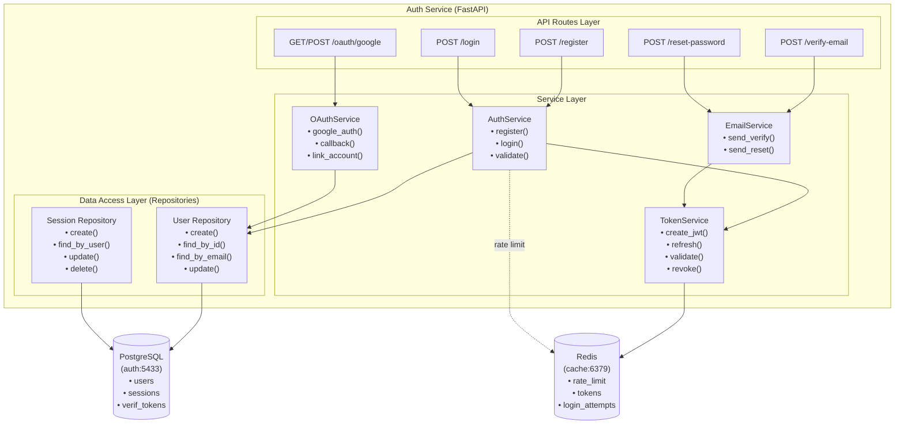

---

### C3.2 — File Service (Components)

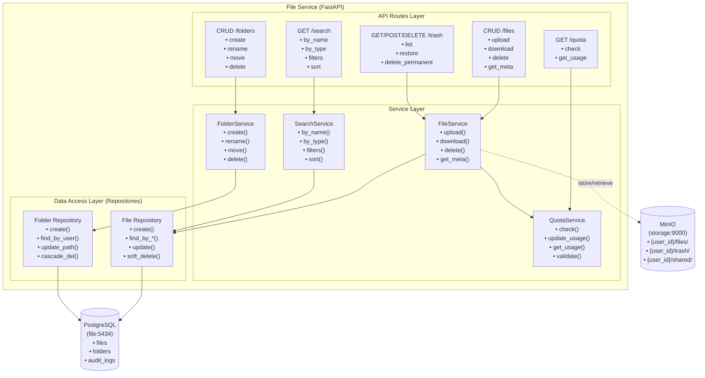

---

### C3.3 — Preview Service (Components)

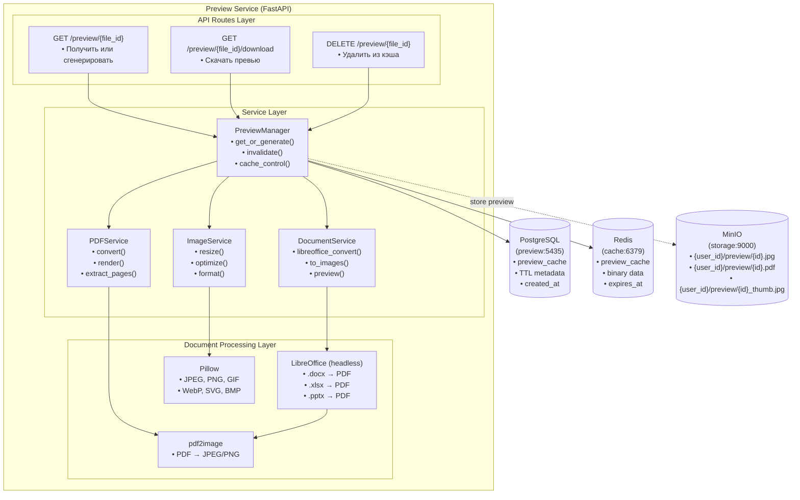

---

### C3.4 — Frontend (Components)

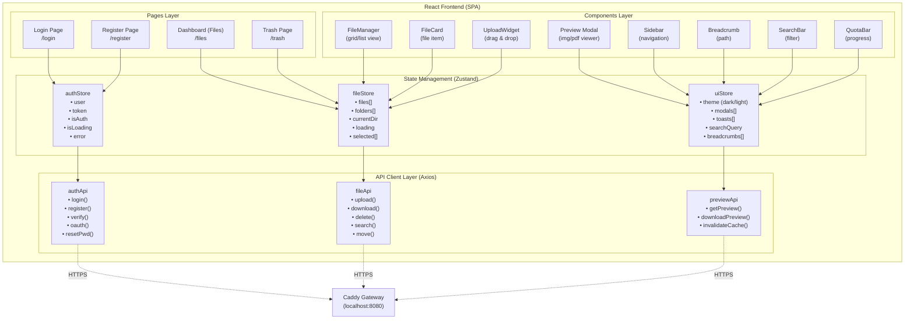

---

### C3.5 — System Context (Общая архитектура)

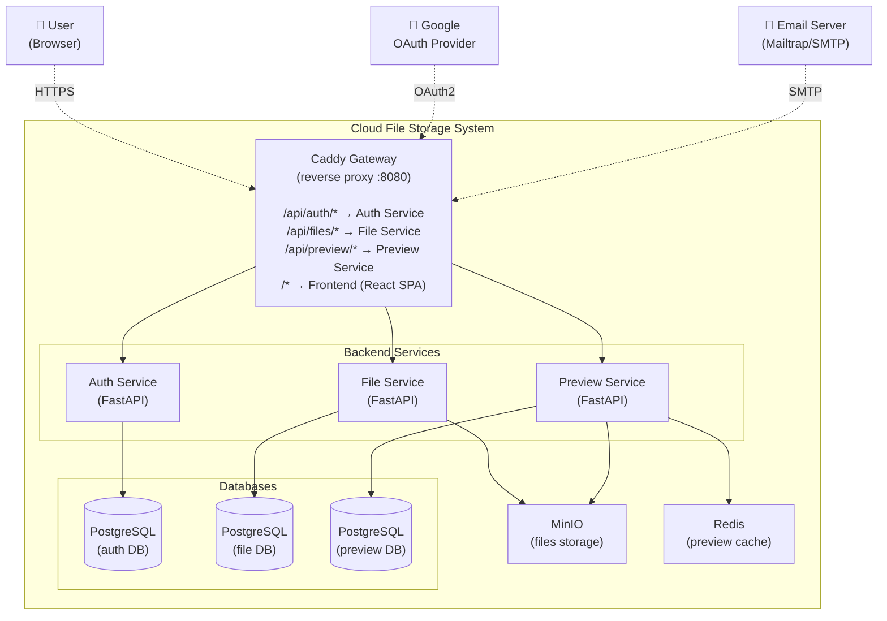

---

## 📐 C4 Diagrams — Code Level (Mermaid Sequence Diagrams)

### C4.1 — Регистрация пользователя (POST /api/auth/register)

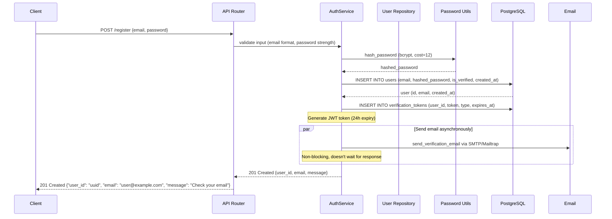

---

### C4.2 — Логин с JWT (POST /api/auth/login)

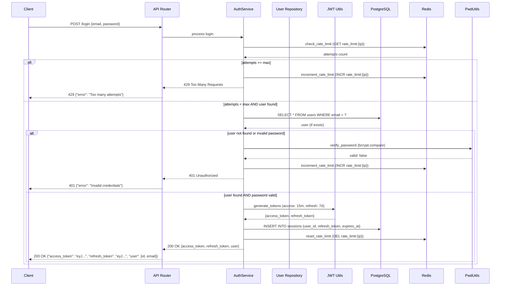

---

### C4.3 — Загрузка файла (POST /api/files/upload)

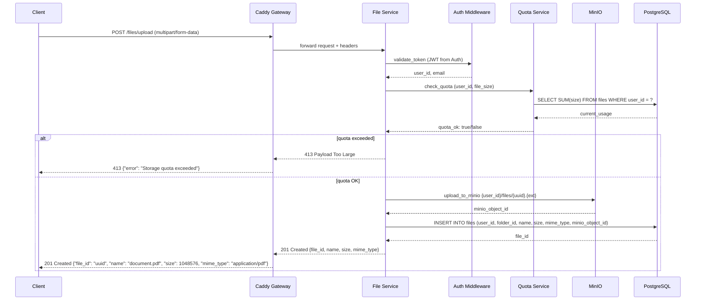

---

### C4.4 — Генерация превью (GET /api/preview/{file_id})

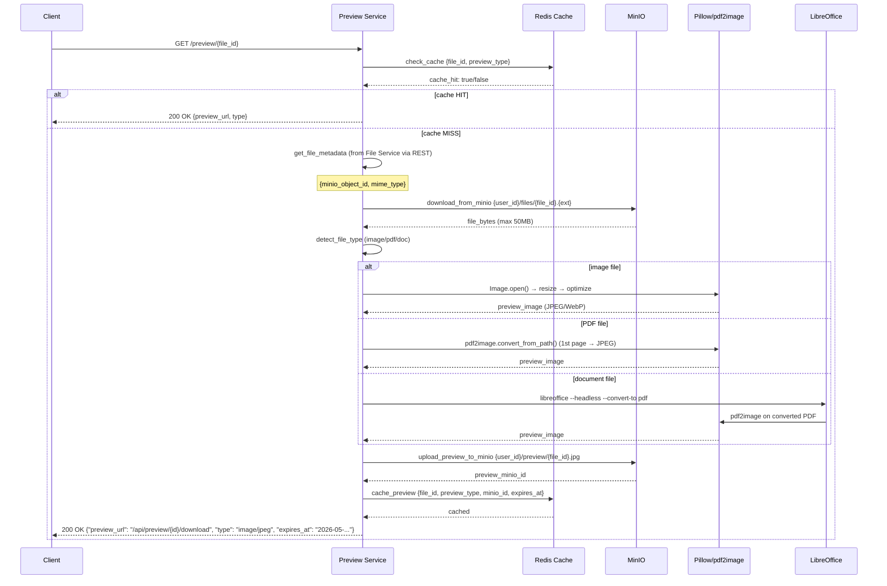

---

### C4.5 — Перемещение в корзину и восстановление

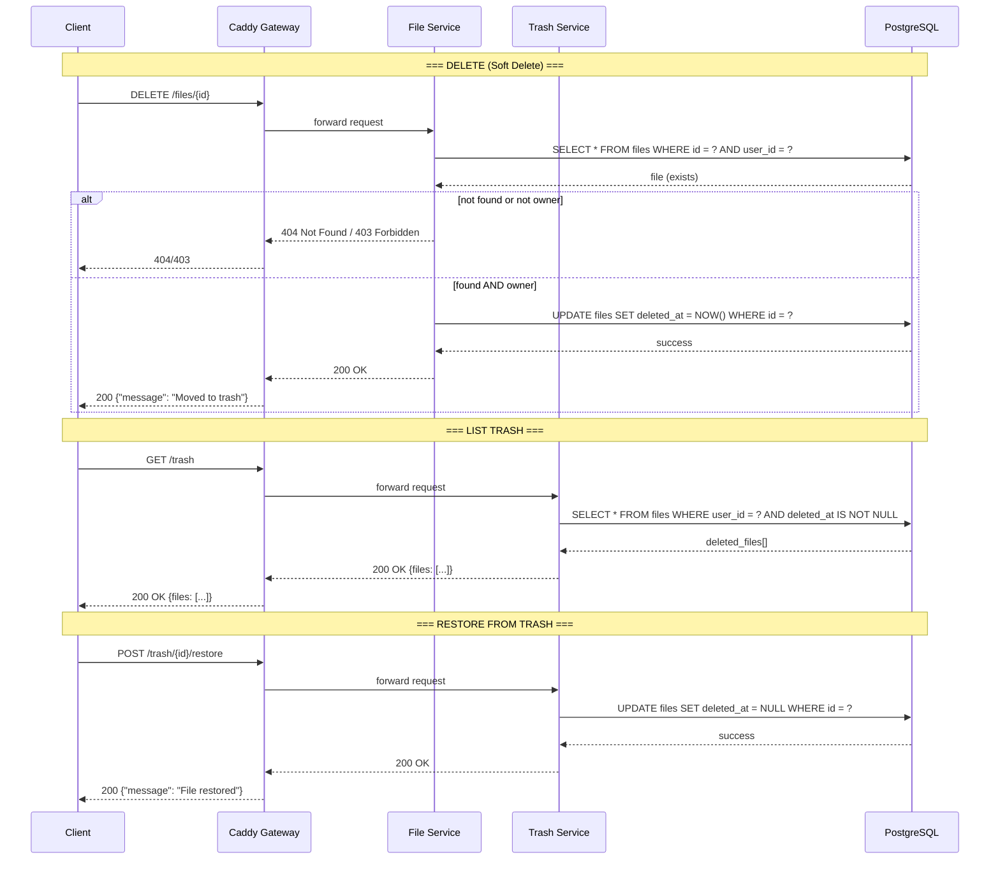

---

### C4.6 — Cron job: Автоматическая очистка корзины (30 дней)

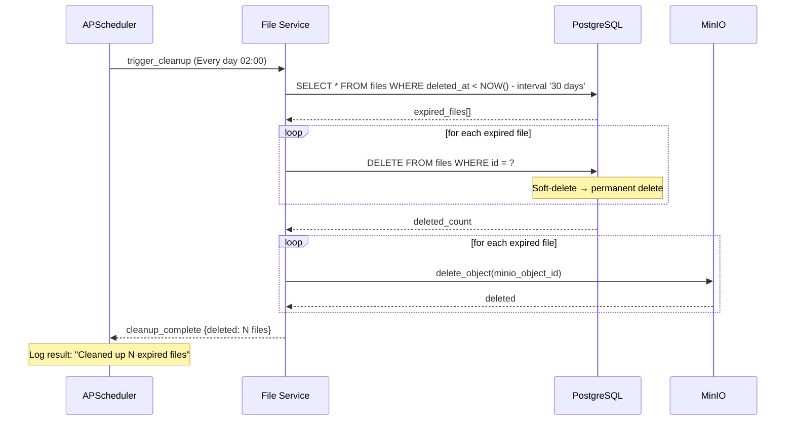

---

### C4.7 — Поиск файлов (GET /api/search?q=query)

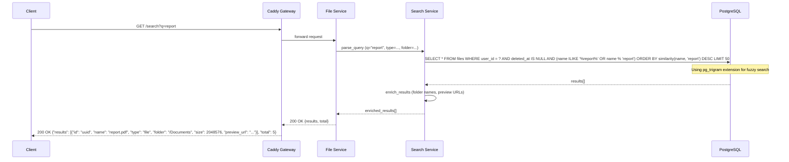
